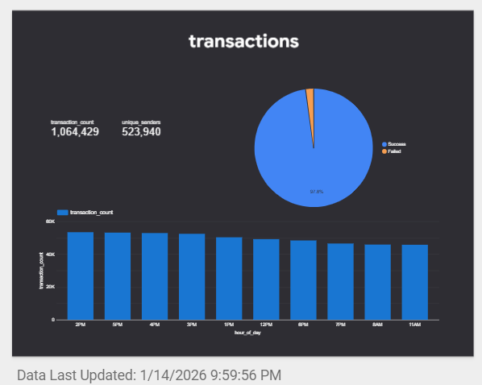
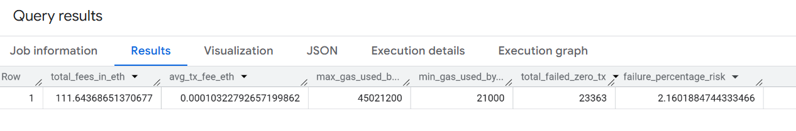

# 🛡️ Ethereum Data Quality Audit: The 58% Zero-Value Mystery

### 📋 Project Overview
This project demonstrates a professional **Data Quality Engineering** workflow applied to Ethereum blockchain transactions. The investigation was triggered by a significant anomaly: **58% of transactions** on 2025-12-01 had a value of zero ETH. I led a three-phase audit to verify if this was a data integrity failure or legitimate system behavior.

---

### 🔍 Phase 1: DQ_Discovery_zeroValue
**Goal:** Initial data profiling to identify integrity gaps and missing records.
* **Action:** Performed a comprehensive completeness check for NULL values and logical consistency.
* **SQL Script:** [`DQ_Discovery_zeroValue.sql`](./DQ_Discovery_zeroValue.sql)
* **Visual Evidence:** 
* **Key Finding:** Discovered that **1,081,526 transactions (approx. 58%)** carried a value of 0 ETH.

---

### ⚖️ Phase 2: DQ_Audit_zeroValue (Forensic Investigation)
**Goal:** Root cause analysis and technical validation of zero-value records.
* **Action:** Developed a forensic SQL script to categorize transactions by `input` type and `receipt_status`.
* **SQL Script:** [`DQ_Audit_zeroValue.sql`](./DQ_Audit_zeroValue.sql)
* **Technical Dashboard:** 
* **Key Insights:** **98.4%** of records were identified as **Contract Calls**, confirming data accuracy with a **97.6% Success Rate**.

---

### 💰 Phase 3: DQ_impact_integrity_zeroValue
**Goal:** Financial impact assessment and resource integrity audit.
* **Action:** Analyzed the economic footprint (Gas Fees) to ensure they were not "data noise".
* **SQL Script:** [`DQ_impact_integrity_zeroValue.sql`](./DQ_impact_integrity_zeroValue.sql)
* **Visual Evidence:** 
* **Key Findings:** Verified **111.64 ETH** in network fees, proving high-value technical operations with a low **2.16% failure risk**.

---

### 🚀 Business Impact & Conclusion
By applying this DQ framework, I successfully distinguished "Technical Noise" from "Data Errors".
* **Outcome:** Provided a **97.6% confidence score** in the blockchain data pipeline.
* **Recommendation:** Approved the dataset for financial reporting, confirming the anomaly reflects smart contract activity.

---

### 🛠️ Technical Stack
* **SQL (BigQuery):** Massive-scale data profiling and forensic auditing.
* **Looker Studio:** Real-time quality monitoring and anomaly visualization.
  
---

  
<b>Prepared & Audited by: Hadeel Mohammed Alhendi</b>

  
<i>Data Quality Engineer | Blockchain Forensic Specialist 🛡️</i>

