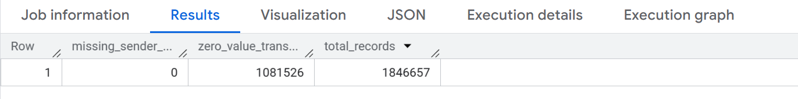

# Ethereum Data Quality Audit Framework 🛡️

## 📌 Professional Statement
This repository showcases my approach to **Data Quality Engineering** as a Computer Science Graduate (Honors). It contains specialized SQL audits designed to monitor and safeguard data integrity within the Ethereum blockchain using Google BigQuery.

## ⚖️ Intellectual Property Notice
All rights reserved. This code is provided for **demonstration and portfolio purposes only**. Unauthorized copying, modification, or distribution of this logic is not permitted.

---

## 🔍 Audit Scope & Findings

### Phase 1: Data Integrity Audit
In this first part of the project, I wanted to ensure the dataset's quality before diving into deeper analysis. I ran a SQL audit to check for missing values and identify any immediate patterns.

**What I found:**
* **Zero Missing Addresses:** The data is quite clean; I found no missing sender addresses across the entire sample.
* **High Volume of Zero-Value Transactions:** I noticed that **1,081,526** transactions had a value of 0. This is a huge portion of the **1,846,657** total records I audited.
* **Next Step:** This high number of zero-value transactions is interesting. I'll be investigating whether these represent smart contract interactions or failed attempts in the next phase.

#### **Execution Results (BigQuery):**

---
**Author:** Hadeel Alhendi
*Bridging the gap between raw data and reliable insights.*
